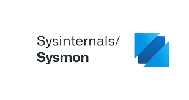
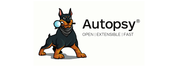
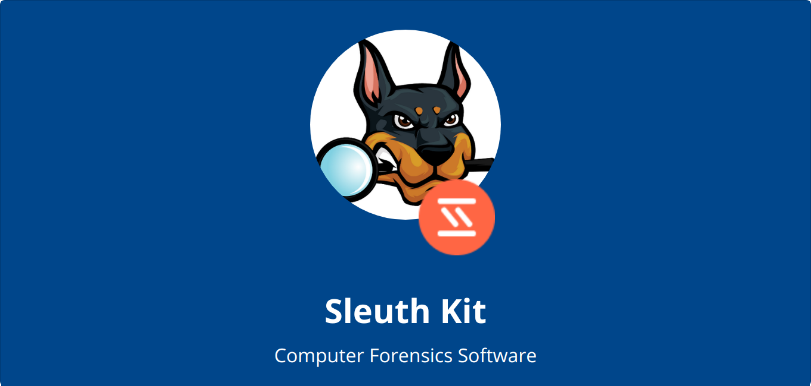
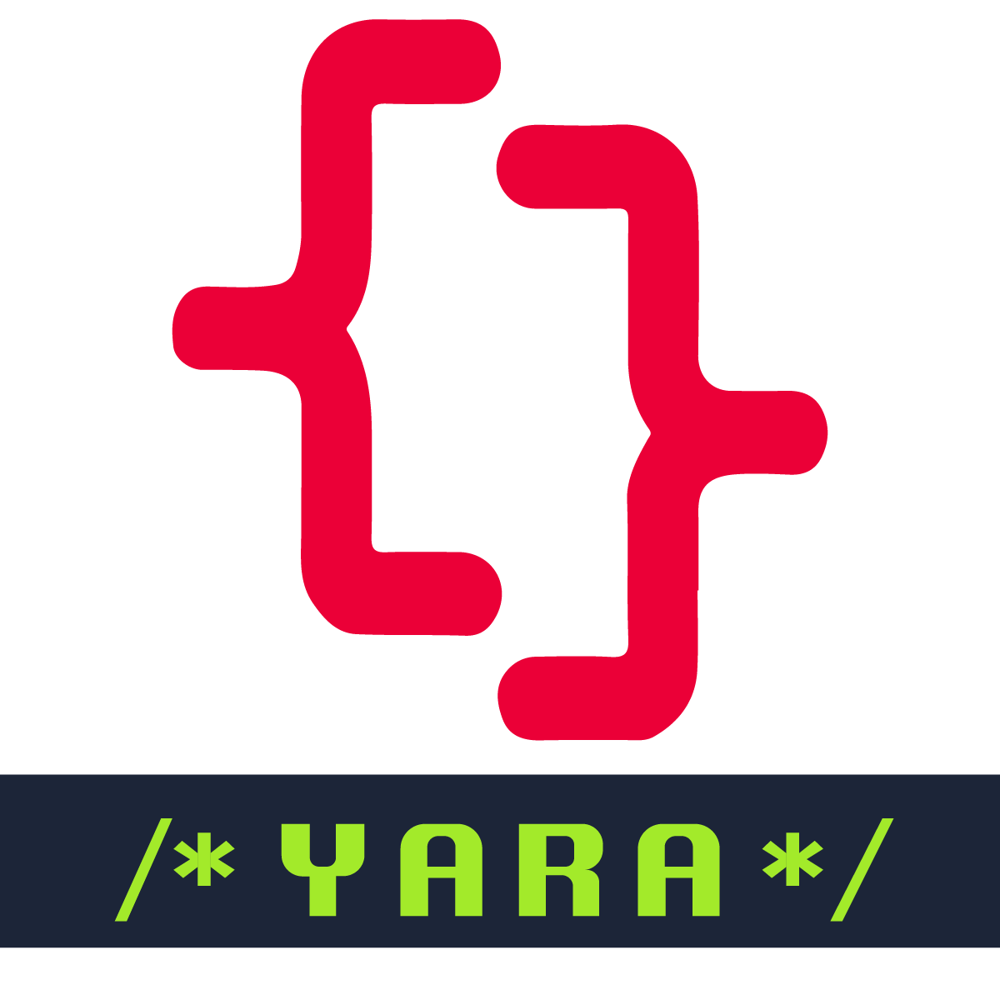
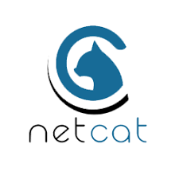
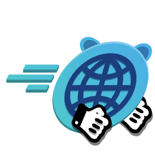
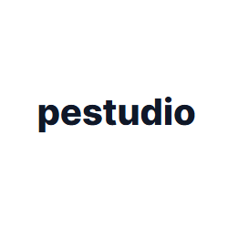
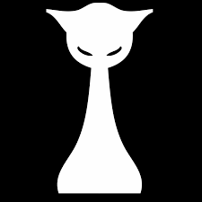

  

<h1 align="center">🛡️ YAOVS — Ziya Shalbuzov</h1>
<h3 align="center">Cybersecurity • Blue Team • DFIR • Linux • Automation</h3>

  

---

## ⚡ About Me

> initializing yaovs...  
> loading analyst profile...  
> environment: Linux Mint  
> role: Blue Team / DFIR / SOC  
> status: active  

- 🎓 CS Student @ **Baku State University**  
- 🔐 Cybersecurity Student @ **TETYM**  
- 🕵️ DFIR • Threat Detection • Log Analysis • Forensics  
- 🐧 Linux Enjoyer  
- ⚙️ Python Automation & Bash Scripting  
- 🔬 Builds labs • Analyzes logs • Experiments with attacks/defense  

  

---

## 🧰 Tech Stack

  
  
  

---

## 🔐 Cybersecurity Tools

### 🛡 Blue Team / DFIR / Analysis

  
  
  
  
  
  
  
  
  
  

### 🌐 Networking & Scanning

  
  
  

### 🧪 Web & App Security

  
  
  

### 🧠 Malware & Memory Forensics

  
  
  
  

---

## 🌐 Profiles & Socials  

  
  
  
  
  
  
  

---

## 🎯 2025 Goals & Roadmap  
- Build full homelab (SIEM, ELK/Opensearch, detection rules)  
- Publish DFIR / Blue Team projects & write-ups  
- Automate IR tasks using Python & Bash  
- Improve Windows internals & memory forensics  
- Earn more technical badges & certifications  

---

  

<h3 align="center">✨ “Hack the skills. Secure the future.” ✨</h3>
